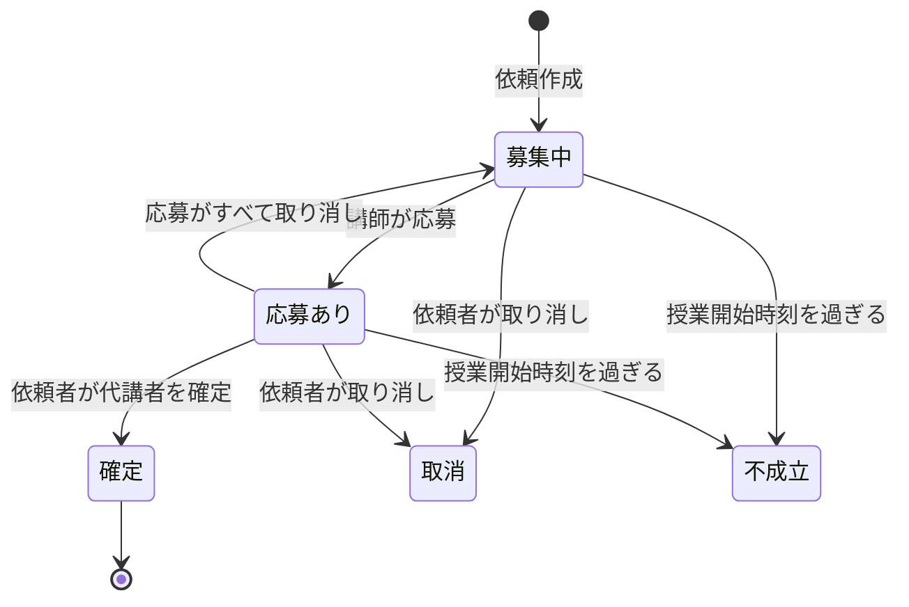
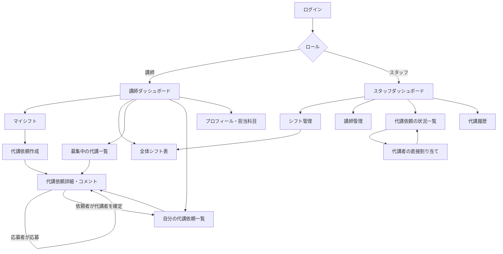

# 要件定義書：代講マッチング・シフト共有システム「DaikoLink」（仮称）

| 項目 | 内容 |
|---|---|
| 作成者 | 小見川 朋輝 |
| 作成日 | 2026-09-28 |
| 版 | 1.1 |
| 開発期間 | Week 22〜24（3週間） |

### 変更履歴
| 版 | 日付 | 内容 |
|---|---|---|
| 1.0 | 2026-09-28 | 初版 |
| 1.1 | 2026-09-28 | ヒアリング結果を反映。代講の確定を「スタッフの承認」から「当事者（依頼者）による確定」に変更。前提条件・規模を更新 |

---

## 1. プロジェクト概要

### 1.1 背景
個別指導塾（講師1人に生徒2人）には、講師が担当授業に出られない場合に他の講師へ授業を代わってもらう「代講」の仕組みがある。代講者は原則として講師本人が事前に見つける必要があり、現在は直接声をかけるか、LINEで個別に連絡して探している。

しかし急用の場合は講師本人が見つけられないことが多く、その場合は教室スタッフ（社員）が当日に講師へ1人ずつ電話をかけて探している。この方法はつながらない・断られることが多くうまくいかないうえに、スタッフの大きな負担になっている。

### 1.2 目的
講師が全講師のシフトを確認でき、サイト上で代講の「依頼 → 応募 → 確定」までを講師どうしで完結できるようにする。これにより、スタッフが電話で代講者を探す負担をなくし、急な欠勤でも授業に穴が開かないようにする。

### 1.3 成功の基準（目標値）
- 代講依頼の7割以上が、スタッフの電話連絡なしで確定する
- 代講依頼から確定までの時間が現状より短くなる
- スタッフが未確定の代講を一覧で即座に把握できる

### 1.4 スコープ
| 対象 | 対象外 |
|---|---|
| 1教室分の講師・スタッフ | 複数教室・教室間の代講 |
| シフトの登録・閲覧（講師どうしで公開） | 給与・勤怠計算 |
| 代講の依頼・応募・確定・通知 | 生徒・保護者向け機能 |
| 代講に関する講師間のやり取り | 生徒の個人情報の管理 |
| 代講履歴の閲覧 | 既存の社内システムとの連携 |

---

## 2. 現状分析

### 2.1 現状の業務フロー（As-Is）
1. 講師Aが担当授業に出られなくなる
2. 講師Aが他の講師に直接声をかけるか、LINEで個別に連絡して代講者を探す
3. 見つからない場合、講師Aがスタッフに報告する
4. スタッフがシフト表を見て、空いていそうな講師に当日1人ずつ電話をかける
5. 代講者が見つかったら、スタッフがシフト表を修正する

### 2.2 課題
- 講師は他の講師のシフトが分からず、誰に頼めばよいか判断できない
- LINEや直接の声かけは相手が限られ、1人ずつなので時間がかかる
- スタッフの電話はつながらない・断られることが多く、うまくいかない
- やり取りがLINEや電話に散らばり、依頼状況や履歴が残らない

### 2.3 導入後の業務フロー（To-Be）
1. 講師Aがサイトで該当コマを選び、代講依頼を出す
2. その日時に授業がない講師へメールで一斉に通知される
3. 引き受けられる講師（B）がサイト上で応募する
4. 講師Aが応募者の中から代講者を選んで確定する（当事者どうしの合意で確定し、スタッフの承認は不要）
5. シフトの担当者が自動で講師Bに変わり、A・B・スタッフに確定通知が届く
6. 授業開始の一定時間前までに確定しない場合、スタッフに通知される

---

## 3. システム概要

### 3.1 利用者（ロール）
| ロール | 主な操作 |
|---|---|
| 講師 | シフト閲覧、代講依頼、応募、代講者の確定、依頼ごとのやり取り |
| スタッフ（管理者） | 講師管理、シフト登録、代講状況の確認、未確定依頼への対応 |

### 3.2 用語
| 用語 | 意味 |
|---|---|
| コマ | 授業の時間枠（例：1限 16:00〜17:20） |
| 代講依頼 | 担当コマを他の講師に代わってほしいという依頼 |
| 応募 | 代講依頼に対して「引き受けられる」と申し出ること |
| 確定 | 依頼者が応募者の中から代講者を決めること |

### 3.3 システム構成
- Webアプリ：Laravel（Blade + Tailwind CSS、Breeze認証）
- DB：MySQL
- 実行環境：Docker（nginx + PHP-FPM + MySQL）、AWS EC2
- メール送信：SendGrid（キューで非同期送信）
- CI/CD：GitHub Actions（lint / test / deploy）

---

## 4. 機能要件

### 4.1 ユーザーストーリー
| ID | ユーザーストーリー | 優先度 |
|---|---|---|
| US-01 | 講師として、自分のシフトを一覧で確認したい。なぜなら担当授業の日時を把握したいから。 | Must |
| US-02 | 講師として、全講師のシフトを日付・コマごとに見たい。なぜなら誰がその時間に空いているか分かれば代講を頼みやすいから。 | Must |
| US-03 | 講師として、出られなくなった授業の代講依頼をサイトから出したい。なぜなら急用でもすぐに代わりを募集したいから。 | Must |
| US-04 | 講師として、代講依頼に科目・学年と引き継ぎメモを書きたい。なぜなら代講者に授業内容を伝えたいから。 | Must |
| US-05 | 講師として、新しい代講依頼が出たらメールで知りたい。なぜならサイトを常に見ていなくても気づけるから。 | Must |
| US-06 | 講師として、募集中の代講依頼の一覧を見たい。なぜなら自分が引き受けられる授業を探したいから。 | Must |
| US-07 | 講師として、代講依頼に応募したい。なぜなら空いている時間で授業を代われるから。 | Must |
| US-08 | 講師として、自分の依頼への応募者の中から代講者を選んで確定したい。なぜなら当事者どうしで合意できれば、スタッフを通さずに代講を決められるから。 | Must |
| US-09 | 講師として、確定した代講が自分のシフトに反映されてほしい。なぜなら担当授業を間違えないようにしたいから。 | Must |
| US-10 | 講師として、自分が出した依頼の状況を確認したい。なぜなら代講者が決まったか知りたいから。 | Must |
| US-11 | 講師として、代講依頼ごとに相手とメッセージをやり取りしたい。なぜならLINEを使わずに引き継ぎの連絡をしたいから。 | Should |
| US-12 | 講師として、まだ確定していない依頼を取り消したい。なぜなら用事がなくなり自分で出られるようになることがあるから。 | Should |
| US-13 | 講師として、担当できる科目・学年を登録したい。なぜなら自分が教えられる依頼だけ通知してほしいから。 | Should |
| US-14 | スタッフとして、講師のシフトを登録・編集したい。なぜならシフト表をシステム上で管理したいから。 | Must |
| US-15 | スタッフとして、講師アカウントを作成・無効化したい。なぜなら入退職に合わせて利用者を管理したいから。 | Must |
| US-16 | スタッフとして、代講依頼の状況を一覧で見たい。なぜなら承認はしなくても、どの授業が誰に代わったかを把握したいから。 | Must |
| US-17 | スタッフとして、代講が確定したら通知で知りたい。なぜなら当日の授業担当の変更を把握したいから。 | Must |
| US-18 | スタッフとして、授業の直前まで確定しない依頼を通知で知りたい。なぜなら自分が代講者を探す必要があるか判断したいから。 | Should |
| US-19 | スタッフとして、未確定の依頼に代講者を直接割り当てたい。なぜなら電話で見つけた代講者をシステムにも反映したいから。 | Could |
| US-20 | スタッフとして、過去の代講履歴を見たい。なぜなら代講の多い講師や時間帯を把握したいから。 | Could |

### 4.2 主要ストーリーの受け入れ基準
**US-03 代講依頼**
- 自分が担当するコマからのみ依頼を作成できる
- 授業開始時刻を過ぎたコマには依頼できない
- 同じコマに対して、未確定の依頼を重複して作成できない
- 作成すると状態が「募集中」になり、その日時に授業がない講師へ通知される

**US-07 応募**
- 同じ日時・コマに自分のシフトがある場合は応募できない
- 自分が出した依頼には応募できない
- 応募すると依頼者に通知される

**US-08 確定**
- 確定できるのは依頼者本人だけ
- 確定すると該当シフトの担当者が応募者に変更される
- 確定すると他の応募は自動で見送りになり、応募者全員に結果が通知される
- 依頼者・代講者・スタッフに確定メールが送られる
- 確定済みの依頼を二重に確定することはできない

### 4.3 機能要件一覧
| ID | 分類 | 機能 | 対象 | 優先度 |
|---|---|---|---|---|
| F-01 | 認証 | ログイン / ログアウト / パスワードリセット | 全員 | Must |
| F-02 | 認証 | アカウントはスタッフが作成（一般の新規登録は不可） | スタッフ | Must |
| F-03 | 講師管理 | 講師の作成・編集・無効化 | スタッフ | Must |
| F-04 | 講師管理 | 担当可能な科目・学年の登録 | 講師 | Should |
| F-05 | シフト | コマ（時間枠）の定義 | スタッフ | Must |
| F-06 | シフト | シフトの登録・編集・削除 | スタッフ | Must |
| F-07 | シフト | 自分のシフト表示（週単位） | 講師 | Must |
| F-08 | シフト | 全体シフト表（日付 × コマ × 講師、空いている講師が分かる） | 全員 | Must |
| F-09 | 代講依頼 | 依頼の作成（科目・学年・理由・引き継ぎメモ） | 講師 | Must |
| F-10 | 代講依頼 | 依頼の取り消し（確定前のみ） | 講師 | Should |
| F-11 | 代講依頼 | 自分の依頼一覧と状況表示 | 講師 | Must |
| F-12 | 応募 | 募集中の依頼一覧 | 講師 | Must |
| F-13 | 応募 | 応募・応募の取り消し（確定前のみ） | 講師 | Must |
| F-14 | 確定 | 依頼者による代講者の確定と、シフトの自動更新 | 講師 | Must |
| F-15 | やり取り | 依頼ごとのコメント（依頼者と応募者） | 講師 | Should |
| F-16 | 管理 | 代講依頼の状況一覧（状態で絞り込み） | スタッフ | Must |
| F-17 | 管理 | 未確定依頼への代講者の直接割り当て | スタッフ | Could |
| F-18 | 通知 | 依頼作成時に、その時間が空いている講師へメール | 講師 | Must |
| F-19 | 通知 | 応募時（依頼者へ）・確定時（当事者とスタッフへ）のメール | 全員 | Must |
| F-20 | 通知 | 担当科目で通知対象を絞り込む | 講師 | Should |
| F-21 | 通知 | 授業開始の一定時間前に未確定ならスタッフへメール | スタッフ | Should |
| F-22 | 履歴 | 代講履歴の一覧 | スタッフ | Could |

### 4.4 代講依頼の状態遷移

### 4.5 主なデータ
| テーブル | 内容 |
|---|---|
| users | 講師・スタッフ（role で区別） |
| subjects / user_subject | 科目と、講師が担当できる科目 |
| time_slots | コマの定義（開始・終了時刻） |
| shifts | 日付 × コマ × 担当講師 |
| substitute_requests | 代講依頼（対象シフト・状態・メモ・確定した代講者） |
| substitute_applications | 応募（依頼・応募者・状態） |
| request_comments | 依頼ごとのコメント |

※ 生徒の氏名などの個人情報は保存しない。

---

## 5. 非機能要件

| 分類 | 要件 |
|---|---|
| パフォーマンス | 各ページの表示3秒以内 / 同時接続30ユーザー / 全体シフト表でN+1を発生させない |
| セキュリティ | HTTPS通信 / パスワードのハッシュ化 / CSRF・XSS対策 / Policyによる認可（確定は依頼者本人のみ、他人の依頼は操作不可、管理機能はスタッフのみ） / ログイン試行回数の制限 |
| データ整合性 | 確定処理はトランザクションで行い、同じ依頼の二重確定や同じ講師の同時刻の二重シフトを防ぐ |
| 個人情報 | 生徒の個人情報を保持しない / デモ環境は架空データのみ |
| 可用性 | 稼働率99%以上 / 授業時間帯にはメンテナンスしない / メンテナンスは深夜 |
| 互換性 | スマートフォン優先のレスポンシブ対応（講師は主にスマホで利用） / Chrome・Safari・Edge最新版 |
| 通知 | メール送信はキューで非同期処理し、画面の応答を遅らせない / メールから1タップで依頼詳細を開ける |
| 保守性 | PSR-12準拠（PHP CS Fixer） / PHPStan / PHPUnitのカバレッジ70%以上 / READMEと環境構築手順を整備 |
| 運用 | GitHub Actionsによる自動テスト・自動デプロイ / DBの日次バックアップ / ログのローテーション |

---

## 6. 画面遷移図（スケッチ）
※ Week 19 で Figma を使って清書する。

---

## 7. 制約条件

| 分類 | 内容 |
|---|---|
| 納期 | Week 22〜24 の3週間で MVP を完成・デプロイ |
| 体制 | 1人で開発 |
| 予算 | 既存の AWS 環境（EC2）と独自ドメインの範囲内。SendGrid は無料枠 |
| 技術 | Laravel / MySQL / Docker / GitHub Actions（これまでの学習で使用した技術に統一） |
| データ | 実在の塾名・講師名・生徒情報は使用しない |

---

## 8. 前提条件・リスク

### 8.1 前提条件
- 1日あたりの出勤講師は約15人（曜日により変動）
- 個別指導で、講師1人に対して生徒2人を担当する
- 授業はコマ制で、1日の時間枠が決まっている
- 代講の確定に社員の承認は不要で、当事者どうしの合意で確定してよい
- 講師どうしが互いのシフトを見ることに問題はない（むしろ代講を探しやすくなる）
- 講師は全員メールアドレスとスマートフォンを持っている

### 8.2 想定リスクと対策
| リスク | 対策 |
|---|---|
| 3週間で全機能を作りきれない | Must を MVP として先に完成させ、Should 以降はフェーズ2へ回す |
| 当事者だけで確定するため、スタッフが担当変更を把握できない | 確定時にスタッフへ自動通知し、状況一覧で常に確認できるようにする |
| 通知メールが迷惑メールに入る | ドメイン認証（SPF・DKIM）を設定し、サイト上でも依頼を確認できるようにする |
| 講師がLINEのやり取りから移行しない | スマホで操作しやすい画面にし、依頼ごとのコメント機能で連絡もサイト内で完結させる |
| 同時に複数の操作が行われ状態が矛盾する | 確定処理をトランザクションとロックで行い、テストで確認する |
| 個人情報の漏えい | 生徒情報を保持せず、認可をPolicyで制御しテストで確認する |

---

## 9. MVP・スコープ管理

### 9.1 コアバリュー
「急な欠勤でも、講師どうしがサイト上で代講者を見つけて確定できる」

### 9.2 MoSCoW分析
| 優先度 | 機能 |
|---|---|
| Must（MVP） | ログイン、講師管理、シフト登録・表示、全体シフト表、代講依頼、募集一覧・応募、依頼者による確定とシフト反映、スタッフ向け状況一覧、依頼・応募・確定時のメール通知 |
| Should | 依頼ごとのコメント、依頼の取り消し、担当科目による通知の絞り込み、未確定依頼のスタッフ通知 |
| Could | スタッフによる代講者の直接割り当て、代講履歴、カレンダー表示、シフトのCSV一括取り込み |
| Won't（今回は対象外） | LINE通知、複数教室対応、給与・勤怠連携、生徒・保護者向け機能、ネイティブアプリ |

### 9.3 検証したい仮説
「空いている講師が一覧で分かり、サイトから一斉に募集できれば、スタッフの電話なしで代講が決まる」

### 9.4 スコープ変更のルール
- 開発中に出た追加要望は、この表の Could / Won't に追記し、MVP 完成後に検討する
- MVP に追加する場合は、工数と納期への影響を見積もってから判断する

---

## 10. 承認
| 役割 | 氏名 | 日付 |
|---|---|---|
| 作成者 | 小見川 朋輝 | 2026-09-28 |
| 承認者 | （メンター） | |
